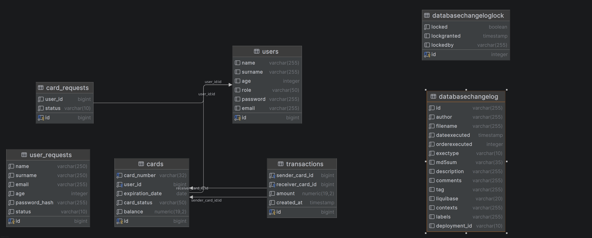
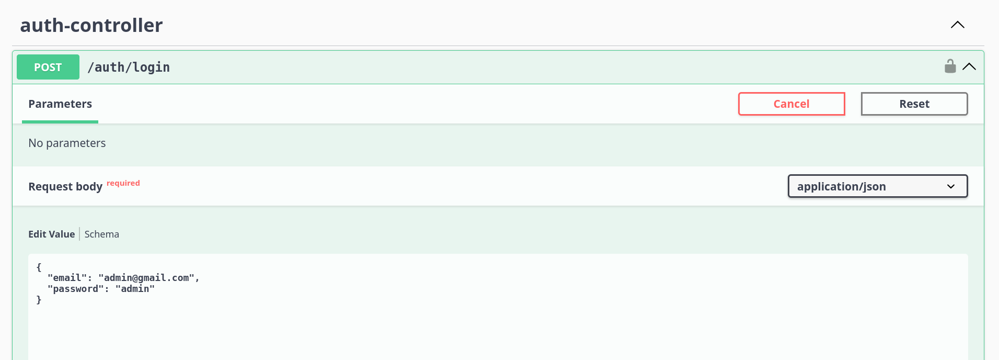

# 💳 Bank Cards Management System

Backend-приложение для управления банковскими картами.

---

## 🚀 Функциональность

### 👤 Пользователь (USER)

- Просмотр своих карт
- Просмотр баланса
- Переводы между своими картами
- Аутентификация
- Запрос на создание аккаунта
- Запрос на создание карты

### 🛠 Администратор (ADMIN)

- Создание карт
- Активация / блокировка карт
- Удаление карт
- Управление пользователями
- Просмотр всех карт
- Аутентификация 
---

## 💳 Карта содержит

- Номер карты (маскируется: `**** **** **** 1234`)
- Владелец
- Срок действия
- Статус (`ACTIVE`, `BLOCKED`, `EXPIRED`)
- Баланс

---

## 🔐 Безопасность

- Аутентификация: JWT
- Авторизация: Spring Security
- Роли:
  - `USER`
  - `ADMIN`
- Пароли хранятся в виде BCrypt-хэша
- Маскирование номера карты

---

## 🧱 Архитектура

Проект построен по слоям:

controller → service → repository → entity


Дополнительно:
- DTO слой
- Mapper'ы
- Exception handling (`@RestControllerAdvice`)

---

## 🛠 Технологии

- Java 17
- Spring Boot
- Spring Security (JWT)
- Spring Data JPA
- PostgreSQL
- Liquibase
- Docker
- Swagger (OpenAPI)

---

## 🗄 База данных

- Используется PostgreSQL
- Миграции: Liquibase

Liquibase создаёт служебные таблицы:
- `databasechangelog`
- `databasechangeloglock`



## Пользователи по умолчанию:
- email - admin@gmail.com
- password: admin

- email - user@gmail.com
- password: user

---

## 📦 Запуск проекта

### 1. Клонировать репозиторий

```bash
git clone https://github.com/igor-blaz/bank-rest.git
cd bank-rest
```

### 2. Запустить через Docker
```bash
docker-compose up --build
```
### 3. Приложение будет доступно (Необходима аутентификация)

[http://localhost:8080/bank](http://localhost:8080/bank/)

---

## 📖 Swagger

Документация API:

[http://localhost:8080/bank/swagger-ui/index.html#/](http://localhost:8080/bank/swagger-ui/index.html#/)

---

## 🔑 Аутентификация


**Получить JWT токен:**

[http://localhost:8080/bank/auth/login#/](http://localhost:8080/bank/auth/login#/)



## 🧪 Тестирование

- Покрыты основные сценарии:
- переводы
- валидации
- исключения

- Используется:

- JUnit 5
- Mockito

## ⚠️ Особенности
- Проверка владения картами при переводе
- Проверка баланса
- Проверка статуса карты (BLOCKED / EXPIRED)
- Статус EXPIRED может вычисляться динамически

---

## 📌 Автор

**Игорь Блажиевский**

- GitHub: https://github.com/igor-blaz
- Telegram: @Blaz201
- Телефон: +7 986 924 12 63
